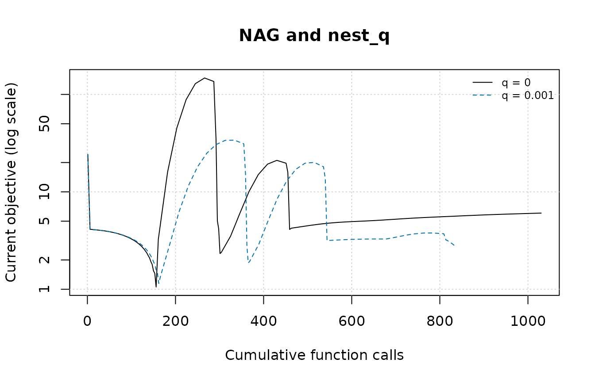
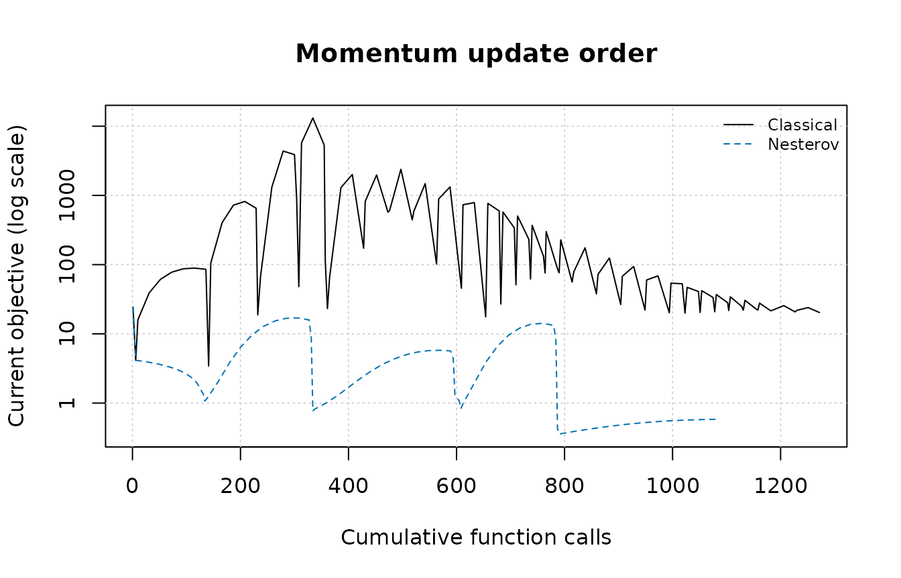
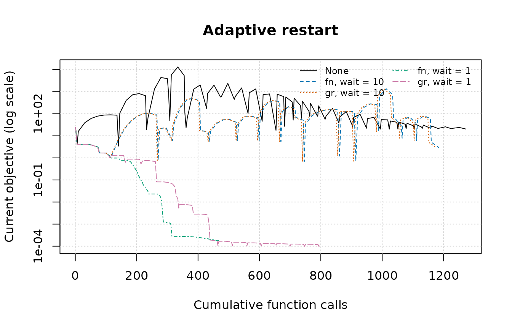

# Choosing methods and tuning

This guide collects the advanced method, line-search, step-size,
momentum, and restart options available in `mize`. Start with [Getting
started](https://jlmelville.github.io/mize/articles/mize.md) for the
basic optimization workflow, then use this guide when choosing or tuning
an optimization strategy.

## Choosing a method

[`mize()`](https://jlmelville.github.io/mize/reference/mize.md) defaults
to `"L-BFGS"`, a good starting point for many smooth problems when an
analytic gradient is available. Change methods for a reason: because the
problem size changes the storage budget, Hessian information is
available, or the experiment is specifically about another update rule.

| Need | Suggested starting point | Main trade-off |
|----|----|----|
| General smooth problem | `"L-BFGS"` | Limited-memory curvature model; usually the first method to try |
| Small or medium smooth problem | `"BFGS"`; consider `"SR1"` for comparison | Dense inverse-Hessian state uses quadratic storage |
| Reliable Hessian or inverse Hessian available | `"NEWTON"` | Strong local model; Hessian construction and factorization can dominate |
| Large Hessian-free problem | `"TN"` | Approximates a Newton direction with an inner solve and extra gradient work |
| Specialized nonlinear conjugate-gradient study | `"CG"` | Low storage; update choice, scaling, and line search matter |
| Momentum experiment | `"NAG"` or `"Momentum"` | Requires a defined schedule and careful comparison of nonmonotone trajectories |
| Known or deliberately controlled learning rate | `"SD"` | Simple baseline; performance depends heavily on the step-size strategy |
| Per-coordinate adaptive learning rate | `"DBD"` | Heuristic update controls both direction scaling and step size |

For algorithmic background, see [Nocedal and
Wright](https://doi.org/10.1007/978-0-387-40065-5). The choices above
are starting points. Benchmark promising methods on the objective at
hand.

### Current method surface

- `"L-BFGS"` maintains its limited-memory approximation from the most
  recent `memory` curvature pairs. Increasing `memory` retains more
  history and costs more storage.
- `"BFGS"` maintains a dense inverse-Hessian approximation, so its
  storage is quadratic in the number of parameters.
- `"SR1"` is a dense symmetric-rank-one alternative. Its update is
  safeguarded, and `mize` falls back to a BFGS or steepest-descent
  direction when necessary to obtain descent.
- `"NEWTON"` uses `fg$hs` or `fg$hi`. A Hessian or inverse Hessian may
  be a full matrix or a diagonal vector; unsuccessful or non-descent
  directions fall back to steepest descent and can be inspected through
  `direction_reason`.
- `"TN"` (truncated Newton) approximately solves for a Newton direction
  using gradient differences. `tn_init`, `tn_exit`, and the optional
  L-BFGS `preconditioner` control its inner solve.
- `"CG"` is nonlinear conjugate gradient. `cg_update = "PR+"` is the
  default; `"HZ+"` is another restart-enabled choice. The reference
  topic lists the complete update vocabulary.
- `"SD"` is steepest descent. It is useful as a baseline and with a
  deliberately chosen constant or adaptive step size. An arbitrary step
  can increase the objective.
- `"NAG"` is Nesterov accelerated gradient. Its momentum depends on
  `nest_q` and related controls. Compare bounded runs with explicit
  metrics.
- `"Momentum"` (which may be abbreviated to `"MOM"`) combines steepest
  descent with a classical or Nesterov-style momentum stage and a chosen
  schedule.
- `"DBD"` is Delta-Bar-Delta. It owns a per-coordinate learning rate, so
  its step controls replace the requested `line_search`.
- `"PHESS"` reuses a partial-Hessian factorization. The factory accepts
  this experimental/internal method when `fg$hs` is available. For
  ordinary work, choose a starting method from the table above.

Each method-specific control has a fixed scope. For example, `memory`
applies to L-BFGS and to the optional L-BFGS preconditioner for CG or
TN; `cg_update` applies only to CG; and `tn_init` and `tn_exit` apply
only to TN. Other methods ignore those controls. The same rule applies
to step-size controls: DBD ignores `line_search`, and Wolfe-only
controls are ignored by constant and bold-driver steps. See
[`?mize`](https://jlmelville.github.io/mize/reference/mize.md) for the
complete accepted values and control scopes.

### Nesterov Accelerated Gradient (`"NAG"`)

NAG takes a steepest-descent step and then applies a momentum update.
Its current objective can increase on an iteration. Inspect the full
bounded trajectory and the returned best result.

`nest_q` controls the built-in NAG schedule. The endpoints are
important: `nest_q = 0` is the non-strongly-convex limit and gives the
largest momentum, whereas `nest_q = 1` gives zero momentum and reduces
the parameter updates to steepest descent. The default is zero. Treat a
value between the endpoints as a tuning choice. A known strong-convexity
ratio requires corresponding information about the objective.

Each comparison reports best and last objectives, callback counts,
status, and termination reason, then plots the same result objects
against cumulative function callbacks.

``` r

nag_runs <- list(
  `q = 0` = mize(
    rb0, rb_fg, method = "NAG", nest_q = 0,
    max_iter = 100, store_progress = TRUE
  ),
  `q = 0.001` = mize(
    rb0, rb_fg, method = "NAG", nest_q = 0.001,
    max_iter = 100, store_progress = TRUE
  )
)
assert_bounded_runs(nag_runs)
knitr::kable(summarize_runs(nag_runs), digits = 6)
```

| Run | Best objective | Last objective | Function callbacks | Gradient callbacks | Status | Termination |
|:---|---:|---:|---:|---:|:---|:---|
| q = 0 | 1.054056 | 6.055306 | 1030 | 1029 | budget_exhausted | max_iter |
| q = 0.001 | 1.147505 | 2.765938 | 835 | 834 | budget_exhausted | max_iter |

``` r

plot_current_objective(nag_runs, "NAG and nest_q")
```



Both rows stop at `max_iter` and demonstrate progress within a fixed
outer iteration budget. Convergence remains unestablished. Here
`q = 0.001` has the lower last objective, while `q = 0` has the lower
returned best objective. The plot shows current iterates; the table
reports both best and last objectives. The conflicting order is the
lesson: define the metric before calling one bounded trajectory
“better.”

The theoretical step size and momentum guarantees require assumptions
and problem constants that this Rosenbrock example does not supply. For
derivations and historical context, see the [Nesterov background
note](https://jlmelville.github.io/mize/articles/nesterov.md).

### Classical Momentum (`"Momentum"`)

Classical momentum adds a fraction of the previous update to a
steepest-descent update. `mom_schedule` defines that fraction:

| Value | Schedule |
|----|----|
| A number such as `0.9` | Constant momentum |
| `"switch"` | Change from `mom_init` to `mom_final` at `mom_switch_iter` |
| `"ramp"` | Increase linearly from `mom_init` to `mom_final` |
| `"nsconvex"` | Use the NAG schedule, controlled by the `nest_*` arguments |
| A function | Compute a scalar from the iteration, optionally also `max_iter` |

A custom schedule can be deterministic when randomness adds no lesson:

``` r

cosine_schedule <- function(iter, max_iter) {
  phase <- min(iter / max_iter, 1)
  0.4 + 0.2 * (1 - cos(pi * phase))
}
custom_momentum <- mize(
  rb0, rb_fg, method = "Momentum", mom_schedule = cosine_schedule,
  max_iter = 10
)
```

The schedule is clamped to the supported momentum range. Built-in
schedules are preferable when they express the intended experiment
directly.

### Classical and Nesterov-style momentum

With `method = "Momentum"`, `mom_type = "classical"` applies momentum
after the gradient step; `mom_type = "nesterov"` applies it before that
step. The schedule remains an independent choice. The next comparison
holds the schedule, start, objective, and iteration budget fixed.

``` r

momentum_runs <- list(
  Classical = mize(
    rb0, rb_fg, method = "Momentum", mom_schedule = 0.9,
    max_iter = 100, store_progress = TRUE
  ),
  Nesterov = mize(
    rb0, rb_fg, method = "Momentum", mom_schedule = 0.9,
    mom_type = "nesterov", max_iter = 100, store_progress = TRUE
  )
)
assert_bounded_runs(momentum_runs)
knitr::kable(summarize_runs(momentum_runs), digits = 6)
```

| Run | Best objective | Last objective | Function callbacks | Gradient callbacks | Status | Termination |
|:---|---:|---:|---:|---:|:---|:---|
| Classical | 3.423736 | 20.331401 | 1272 | 1271 | budget_exhausted | max_iter |
| Nesterov | 0.353595 | 0.584473 | 1088 | 1087 | budget_exhausted | max_iter |

``` r

plot_current_objective(momentum_runs, "Momentum update order")
```



These runs also exhaust `max_iter`. Their table records what happened
under this configuration. Treat the two update orders as choices to test
on the problem at hand. Use `mom_schedule = "nsconvex"` to combine
either order with the NAG schedule. With that schedule,
`nest_convex_approx = TRUE` selects Sutskever’s approximation for the
`nest_q = 0` case and causes `nest_q` to be ignored.

## Line searches and step sizes

Most methods first choose a direction and then use `line_search` to
choose how far to move. DBD is the main exception: it chooses
per-coordinate learning rates itself and ignores `line_search`.

| Choice | What it accepts | Useful starting context |
|----|----|----|
| `"More-Thuente"` | Strong Wolfe conditions by default | Default for direction methods, including quasi-Newton and CG |
| `"Rasmussen"` or `"Schmidt"` | Strong Wolfe conditions by default | Alternative Wolfe implementations for comparison or troubleshooting |
| `"Hager-Zhang"` | Standard curvature plus approximate Armijo by default | CG-oriented Wolfe search with Hager-Zhang initializers |
| `"Backtracking"` | Armijo sufficient decrease | Simpler search when a curvature condition is unnecessary |
| `"Bold Driver"` | Any finite objective decrease | Heuristic adaptation from the preceding accepted step |
| `"Constant"` | No search; always uses numeric `step0` | Known learning rate or a controlled experiment |

Each line-search control has a fixed scope. `c2`, `strong_curvature`,
and `approx_armijo` apply only to Wolfe searches. `c1` also applies to
Armijo backtracking. Bold driver and constant steps ignore it.
`ls_max_alpha` and `ls_safe_cubic` are More-Thuente-specific. The DBD
controls are described separately below.

### Wolfe conditions and `c2`

For a direction \\p\\, define the line function \\\phi(\alpha) = f(x +
\alpha p)\\ and assume the initial slope \\\phi'(0) = g(x)^T p\\ is
negative. Wolfe searches require sufficient decrease and a curvature
condition. Under the strong curvature condition,

\\ \|\phi'(\alpha)\| \leq c_2 \|\phi'(0)\|. \\

A smaller `c2` makes the right-hand side smaller, so it is **stricter**;
a larger `c2` is looser. The same direction holds for the standard
curvature condition because the initial slope is negative. `c2` must lie
strictly between `c1` and 1.

The CG default is `c2 = 0.1`. The next bounded example sets `c2 = 0.5`,
making the curvature test looser. It also selects the Hager-Zhang
next-step initializer. The table displays the resulting initial
proposals, slopes, line-search outcomes, and callback counts.

``` r

looser_c2 <- mize(
  rb0,
  rb_fg,
  method = "CG",
  cg_update = "HZ+",
  line_search = "More-Thuente",
  c2 = 0.5,
  step_next_init = "hz",
  max_iter = 4,
  abs_tol = NULL,
  rel_tol = NULL,
  grad_tol = NULL,
  ginf_tol = NULL,
  step_tol = NULL,
  store_progress = TRUE
)

line_search_columns <- c(
  "alpha_init", "slope_init", "ls_reason", "ls_outcome", "ls_nf", "ls_ng"
)
line_search_diagnostics <- looser_c2$progress[
  !is.na(looser_c2$progress$ls_reason),
  line_search_columns,
  drop = FALSE
]
rownames(line_search_diagnostics) <- NULL
line_search_diagnostics
#>     alpha_init    slope_init ls_reason ls_outcome ls_nf ls_ng
#> 1 1.844054e-05 -54227.360000     wolfe      wolfe     3     3
#> 2 3.955723e-04 -23276.127877     wolfe      wolfe     2     1
#> 3 4.790426e-04   -140.780891     wolfe      wolfe     2     1
#> 4 1.480070e-01     -3.194382     wolfe      wolfe     5     4
```

`alpha_init` is the safeguarded starting proposal and `slope_init` is
\\\phi'(0)\\. `ls_reason` says why the search stopped, while
`ls_outcome` says what kind of point was ultimately selected; the two
need not be identical. `ls_nf` and `ls_ng` count callbacks owned by that
outer line search, excluding its cached starting point. These columns
are method-specific and appear only when their owning stage supplies
them.

More-Thuente, Rasmussen, and Schmidt use strong curvature with the exact
Armijo condition by default. Hager-Zhang uses the standard curvature
condition with the approximate Armijo condition by default.
`strong_curvature` and `approx_armijo` can override those choices. An
override changes the conditions whose theory applies; treat it as an
explicit experiment.

### Initial step estimates

On the first outer iteration, the named `step0` choices use the starting
gradient \\g\\ and direction \\p\\. Writing the directional derivative
as \\\phi'(0) = g^T p\\, the current formulas are:

- `"rasmussen"`: \\1 / (1 - \phi'(0))\\. For steepest descent, this
  becomes \\1 / (1 + \lVert g \rVert_2^2)\\.
- `"scipy"`: \\-\lVert g \rVert_2 / \phi'(0)\\. For steepest descent,
  where \\p = -g\\, this reduces to \\1 / \lVert g \rVert_2\\.
- `"schmidt"`: \\1 / \lVert g \rVert_1\\; there is no added 1 in the
  denominator.
- `"hz"`: Hager-Zhang scaling based first on the relative infinity norms
  of the parameters and gradient, then on the objective and squared
  gradient norm, with a safeguarded fallback.

A positive finite numeric `step0` bypasses these formulas. Hager-Zhang
uses its own first-step estimator by default; the other gradient
searches default to Rasmussen.

After the first iteration, `step_next_init` can use a slope ratio,
quadratic interpolation, the Hager-Zhang `"hz"` rule, or a fixed
positive number. Hager-Zhang’s next-step rule may make one
objective-only probe to fit a quadratic. The probe is attempted only
when there is a previous step and both the local line-search budgets and
the optimizer’s remaining hard budgets leave enough callbacks for the
probe and a subsequent search. Otherwise the rule falls back to an
enlarged, safeguarded version of the previous step. When the probe
occurs, it is included in `ls_nf`, as in the diagnostic vocabulary
above.

`try_newton_step` gives the calculated proposal a small upward
adjustment, up to the natural unit step of 1. Its current default is
`TRUE` for `"NEWTON"`, `"PHESS"`, `"BFGS"`, `"SR1"`, `"L-BFGS"`, and
`"TN"`, and `FALSE` otherwise. `"PHESS"` remains experimental/internal
despite sharing this default. Set `try_newton_step` explicitly when
comparing initialization policies.

### Backtracking, constant, and bold-driver steps

Armijo backtracking repeatedly reduces the candidate until it provides
the decrease controlled by `c1`. With `step_down = NULL`, the current
implementation uses cubic interpolation and evaluates function and
gradient at candidate points. A numeric `step_down` instead multiplies
the candidate by that fixed factor and uses function-only candidate
evaluations.

``` r

backtracking_res <- mize(
  rb0,
  rb_fg,
  method = "SD",
  line_search = "Backtracking",
  step0 = 1,
  step_down = 0.5,
  max_iter = 10
)

constant_res <- mize(
  rb0,
  rb_fg,
  method = "SD",
  line_search = "Constant",
  norm_direction = TRUE,
  step0 = 0.01,
  max_iter = 10
)

bold_res <- mize(
  rb0,
  rb_fg,
  method = "SD",
  line_search = "Bold Driver",
  step_down = 0.5,
  step_up = 1.1,
  max_iter = 10
)
```

The constant strategy requires a numeric `step0` and performs no search.
With steepest descent, `norm_direction = TRUE` makes `step0` the
parameter-update length directly.

Bold driver accepts the first tested point with a lower objective,
reduces failed proposals by `step_down`, and initializes the next
iteration by multiplying the last accepted step by `step_up`. In the
current implementation the first bold-driver proposal is 1; `step0`,
`c1`, `c2`, and `step_up_fun` do not configure it. `ls_max_fn` is its
local callback limit.

For Wolfe and backtracking searches, `ls_max_fn`, `ls_max_gr`, and
`ls_max_fg` limit callbacks within one outer line search. The optimizer
budgets `max_fn`, `max_gr`, and `max_fg` remain hard limits for the
entire run. The default local function limit is 20. See the [line-search
reference](https://jlmelville.github.io/mize/reference/mize.html#line-search)
for the remaining specialized safeguards.

## Delta-Bar-Delta learning rates

`method = "DBD"` changes a per-coordinate learning rate from the
agreement in sign between the current gradient and a weighted history.
Because DBD chooses both the direction scaling and the step,
`line_search` is ignored.

The main controls are:

- `step0`, the initial per-coordinate learning rate (a positive number
  or a named first-step estimator);
- `step_down`, the multiplicative decrease when signs disagree;
- `step_up`, the increase when signs agree;
- `step_up_fun`, either `"*"` for a proportional increase (the default)
  or `"+"` for an additive increase; and
- `dbd_weight`, the gradient-history weight when no momentum schedule is
  used.

The following uses the additive update associated with the t-SNE-style
variant. It demonstrates the control semantics. Use problem-specific
evidence before adopting it for smooth optimization.

``` r

dbd_res <- mize(
  rb0,
  rb_fg,
  method = "DBD",
  step0 = "rasmussen",
  step_down = 0.8,
  step_up = 0.2,
  step_up_fun = "+",
  dbd_weight = 0.5,
  max_iter = 10
)
```

If a momentum schedule is supplied with DBD, `dbd_weight` is ignored and
the momentum update supplies the history. DBD’s step calculation itself
is gradient-based. Function-based convergence criteria still request
objective evaluations, and
[`mize()`](https://jlmelville.github.io/mize/reference/mize.md) may need
an objective observation to report a best result. Choose convergence
controls according to the observations the run can afford, and budget
for those observations explicitly.

## Adaptive restart

[O’Donoghue and Candes](https://arxiv.org/abs/1204.3982) proposed
restarting accelerated schemes when momentum appears unhelpful. A
restart discards the stored momentum update and resets
iteration-dependent momentum schedules. In `mize`, it can be applied to
any optimizer configuration that uses momentum.

| `restart` | Trigger                                                   |
|-----------|-----------------------------------------------------------|
| `"fn"`    | The objective does not decrease on consecutive iterations |
| `"gr"`    | The proposed update is not a descent direction            |
| `"speed"` | The update vector does not grow in Euclidean norm         |

Gradient restart is unavailable with `mom_type = "nesterov"` because its
gradient is evaluated at a different location. `restart_wait` is the
number of iterations to wait after a restart before another restart is
allowed; its default is 10. `restart_wait` governs restart policy;
termination controls govern convergence.

The following comparison uses classical momentum so these restart
configurations are valid. It holds the start, schedule, and
100-iteration budget fixed, then varies restart type and wait. The
no-restart result is reused from the preceding comparison.

``` r

restart_runs <- list(
  None = momentum_runs[["Classical"]],
  `fn, wait = 10` = mize(
    rb0, rb_fg, method = "Momentum", mom_schedule = 0.9,
    restart = "fn", restart_wait = 10,
    max_iter = 100, store_progress = TRUE
  ),
  `gr, wait = 10` = mize(
    rb0, rb_fg, method = "Momentum", mom_schedule = 0.9,
    restart = "gr", restart_wait = 10,
    max_iter = 100, store_progress = TRUE
  ),
  `fn, wait = 1` = mize(
    rb0, rb_fg, method = "Momentum", mom_schedule = 0.9,
    restart = "fn", restart_wait = 1,
    max_iter = 100, store_progress = TRUE
  ),
  `gr, wait = 1` = mize(
    rb0, rb_fg, method = "Momentum", mom_schedule = 0.9,
    restart = "gr", restart_wait = 1,
    max_iter = 100, store_progress = TRUE
  )
)
assert_bounded_runs(restart_runs)
knitr::kable(summarize_runs(restart_runs), digits = 6)
```

| Run | Best objective | Last objective | Function callbacks | Gradient callbacks | Status | Termination |
|:---|---:|---:|---:|---:|:---|:---|
| None | 3.423736 | 20.331401 | 1272 | 1271 | budget_exhausted | max_iter |
| fn, wait = 10 | 0.687237 | 2.964871 | 1184 | 1174 | budget_exhausted | max_iter |
| gr, wait = 10 | 0.687237 | 2.964871 | 1175 | 1174 | budget_exhausted | max_iter |
| fn, wait = 1 | 0.000175 | 0.000175 | 470 | 461 | budget_exhausted | max_iter |
| gr, wait = 1 | 0.000097 | 0.000119 | 797 | 796 | budget_exhausted | max_iter |

``` r

plot_current_objective(restart_runs, "Adaptive restart")
```



Every row again reports `budget_exhausted` / `max_iter`. These runs
demonstrate bounded progress and leave convergence unestablished. Both
wait-1 rows reach smaller best and last objectives than their wait-10
counterparts. The gradient/wait-1 row has slightly smaller objective
values than the function/wait-1 row and uses more function and gradient
callbacks. These conclusions apply to the displayed bounded run.

Function-based validation can add an objective callback when the needed
value is not cached; gradient validation likewise depends on where
gradients are already available. Compare both callback columns; cached
observations determine the cost of each trigger. A shorter
`restart_wait` permits more frequent restarts and can change both
progress and callback demand, so tune it under the budget and metric
that matter for the application.

## See also

- [Getting started](https://jlmelville.github.io/mize/articles/mize.md)
  provides the shortest route to a first result.
- [Convergence](https://jlmelville.github.io/mize/articles/convergence.md)
  explains the status and termination fields used in every bounded
  comparison.
- [Nesterov accelerated gradient and
  momentum](https://jlmelville.github.io/mize/articles/nesterov.md)
  develops the schedule derivations and historical background.
- [Quasi-hyperbolic
  momentum](https://jlmelville.github.io/mize/articles/qhm.md) covers
  another momentum formulation.
